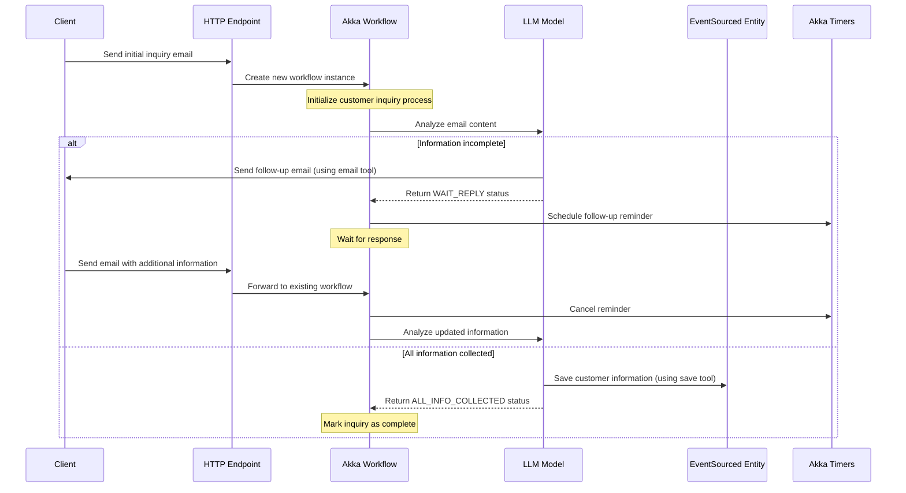

# Real Estate Customer Service Agent

A sample application demonstrating how to build a customer service agent for real estate inquiries,
by combining Akka features and an LLM model.

## Overview

This project illustrates an Agentic workflow for real estate customer service using Akka. The agent:

- Processes incoming email inquiries about real estate properties
- Analyzes the content of email to extract details on what the costumer is looking for
- Provides in-context follow-up responses when needed
- Saves the collected information for further processing

### Akka components

This sample leverages specific Akka components:

- **Workflow**: that manages the customer inquiry process from the first interaction until all the information is collected, handling the sequential steps of analyzing the inquiry, retrieving property data, and generating appropriate responses. The workflow is also used to store the sequence of emails exchanged between customer and AI.
- **EventSourced Entity**: used to maintain the customer information details, registering all the updates occurred as a sequence of events.
- **Timers**: are used to schedule tasks that need to be executed at a later time. In this case, a timer is scheduled to send a follow-up with the client if there is no reply within a default time span. 
- **HTTP Endpoint**: used to serve the application endpoints for receiving email inquiries (`/emails`) 

### Other

- **LLM model**: The agent uses an LLM model to interpret the content of the email and extract the required information. If not all the required information is provided, the agent will send a follow-up email to ask for more details. The LLM is provided with 2 tools, one to send email and another one to save customer information.

### Typical flow

The following diagram illustrates the typical interaction flow of the Real Estate Customer Service Agent:




## Running the application

### Prerequisites
- Java 21 or higher
- Maven 3.6 or higher

### Build and run

To run the sample, you need to provide an OpenAI API key and provide it as an environment variable:
```shell
export OPENAI_API_KEY=your-openai-api-key
```

Build and run the application:
```shell
# Run the application
mvn compile exec:java
```

### Testing the agent

With the application running, you can test the agent using the following endpoints:

Submit an email inquiry:
```shell
curl -i -XPOST --location "http://localhost:9000/emails" \
  --header "Content-Type: application/json" \
  --data '{"sender": "john@example.com", "subject":"Looking to rent T2 in Porto", "content": "Hello, I am looking to rent a T2 in Porto. Can you help me?"}'
```

The agent will likely decide to follow up with an email to ask for more information (your full name, phone number, etc.). Once you provide the missing information:
```shell
curl -i -XPOST --location "http://localhost:9000/emails" \
  --header "Content-Type: application/json" \
  --data '{"sender": "john@example.com", "subject":"Looking to rent T2 in Porto", "content": "My name is John Doe. My number is 911111111. Looking for an apartment."}'
```

The process of information collection should be marked as completed and ready for human follow-up.


## Deployment

You can use the [Akka Console](https://console.akka.io) to create a project and deploy this service.

```shell
# Build container image
mvn clean install -DskipTests

# Deploy using Akka CLI
akka service deploy real-estate-cs-agent real-estate-cs-agent:tag-name --push
```

For more information on deployment, refer to [Deploy and manage services](https://doc.akka.io/operations/services/deploy-service.html).

To understand the Akka concepts that are the basis for this example, see [Development Process](https://doc.akka.io/concepts/development-process.html) in the documentation.